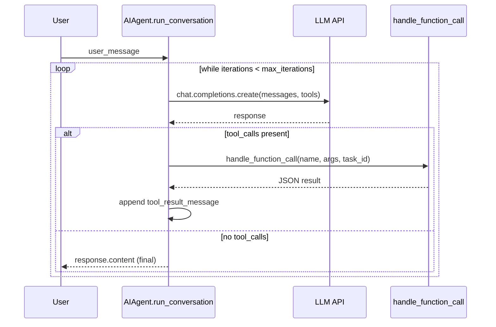

# The agent loop

## `AIAgent` (`run_agent.py`)

`class AIAgent` is defined at `run_agent.py:320`. Its `__init__` takes roughly 60
parameters in the real signature (credentials, routing, callbacks, session context,
budget, credential pool, etc.); the commonly-touched subset per `AGENTS.md`:

```python
class AIAgent:
    def __init__(self,
        base_url=None, api_key=None, provider=None,
        api_mode=None,          # "chat_completions" | "codex_responses" | ...
        model="",                # empty -> resolved from config/provider later
        max_iterations=90,       # tool-calling iterations, shared with subagents
        enabled_toolsets=None, disabled_toolsets=None,
        quiet_mode=False, save_trajectories=False,
        platform=None,           # "cli", "telegram", etc.
        session_id=None, skip_context_files=False, skip_memory=False,
        credential_pool=None,
        # ... callbacks, thread/user/chat IDs, iteration_budget, fallback_model,
        # checkpoints config, prefill_messages, service_tier, reasoning_config, etc.
    ): ...
```

Two public methods (`run_agent.py:5072`, `run_agent.py:5085`):

- `chat(message: str) -> str` — simple interface, returns the final response string.
- `run_conversation(user_message, system_message=None, conversation_history=None,
  task_id=None) -> dict` — full interface, returns `{final_response, messages, ...}`.

## The loop itself

Entirely synchronous, with interrupt checks and budget tracking (from `AGENTS.md`,
matches the structure at `run_agent.py:5072`):

```python
while (api_call_count < self.max_iterations and self.iteration_budget.remaining > 0) \
        or self._budget_grace_call:
    if self._interrupt_requested:
        break
    response = client.chat.completions.create(model=model, messages=messages, tools=tool_schemas)
    if response.tool_calls:
        for tool_call in response.tool_calls:
            result = handle_function_call(tool_call.name, tool_call.args, task_id)
            messages.append(tool_result_message(result))
        api_call_count += 1
    else:
        return response.content
```

Messages follow OpenAI chat-completions format
(`{"role": "system"|"user"|"assistant"|"tool", ...}`); reasoning content lives in
`assistant_msg["reasoning"]`. `max_iterations` (default 90) is shared with any
subagents spawned via `delegate_task`.



## Tool dispatch chain

`model_tools.py` is deliberately a thin orchestration layer (its own docstring,
`model_tools.py:1-20`) over `tools/registry.py`. Every `tools/*.py` file that
contains a top-level `registry.register(...)` call is auto-imported by
`discover_builtin_tools()` (`tools/registry.py:56`) — no manual import list. The
registered `ToolEntry` carries the tool's JSON schema, handler, toolset membership,
and an availability `check_fn` (e.g. "is the required API key set").

`toolsets.py` groups tool names into named bundles (`TOOLSETS` dict). Each
platform's adapter selects a base toolset — e.g. Telegram uses `"messaging"` — and
most platforms inherit from `_HERMES_CORE_TOOLS` (`toolsets.py:30`), the shared list
covering web search/extract, terminal/process, file ops, vision/image-gen, and
skills. Current toolset keys per `AGENTS.md`: `browser`, `clarify`, `code_execution`,
`cronjob`, `debugging`, `delegation`, `discord`, `discord_admin`, `feishu_doc`,
`feishu_drive`, `file`, `homeassistant`, `image_gen`, `kanban`, `memory`,
`messaging`, `moa`, `rl`, `safe`, `search`, `session_search`, `skills`, `spotify`,
`terminal`, `todo`, `tts`, `video`, `vision`, `web`, `yuanbao`.

Async tool handlers run on a persistent per-process/per-thread event loop
(`model_tools.py`'s `_get_tool_loop()`) rather than `asyncio.run()`, specifically to
avoid "Event loop is closed" errors from cached `httpx`/`AsyncOpenAI` clients closing
their transport against a dead loop during GC.

Adding a built-in tool requires two files (see `AGENTS.md` "Adding New Tools" for the
full snippet): a `tools/your_tool.py` calling `registry.register(...)`, **and** a
listing in `toolsets.py` — discovery imports the schema automatically, but a tool is
only exposed to an agent if a toolset names it. For custom/local-only tools, the
preferred route is a plugin (`~/.hermes/plugins/<name>/plugin.yaml` +
`ctx.register_tool(...)`) rather than editing core.

## `delegate_task` — subagents

`tools/delegate_tool.py` spawns a subagent with its own context and terminal
session. Delegation is **synchronous**: the parent blocks on the child's summary,
and interrupting the parent cancels the child.

Two call shapes:
- **Single** — `goal` (+ optional `context`, `toolsets`).
- **Batch (parallel)** — `tasks: [...]`, each gets its own concurrent subagent,
  capped by `delegation.max_concurrent_children` (default 3).

Roles:
- `role="leaf"` (default) — cannot call `delegate_task`, `clarify`, `memory`,
  `send_message`, `execute_code`.
- `role="orchestrator"` — retains `delegate_task` to spawn its own workers; gated by
  `delegation.orchestrator_enabled` (default true) and bounded by
  `delegation.max_spawn_depth`.

`tools/delegate_tool.py:133` sets `MAX_DEPTH = 1` by default — flat delegation
(parent depth 0 → child depth 1; a grandchild is rejected unless `max_spawn_depth`
is raised). Neither `max_concurrent_children` nor `max_spawn_depth` has a hardcoded
upper ceiling — only the config-driven floor/default.

Delegation is **not durable**: for work that must outlive the current turn, use
`cronjob` (see [workflows/automation-cron-kanban.md](../workflows/automation-cron-kanban.md))
or `terminal(background=True, notify_on_complete=True)` instead.

## Related

- [architecture/overview.md](overview.md) — where this loop sits relative to the
  other entrypoints.
- [integrations/plugins-and-providers.md](../integrations/plugins-and-providers.md) —
  how tools/toolsets compose with the general plugin system.
- [workflows/automation-cron-kanban.md](../workflows/automation-cron-kanban.md) —
  durable, headless alternatives to `delegate_task`.
