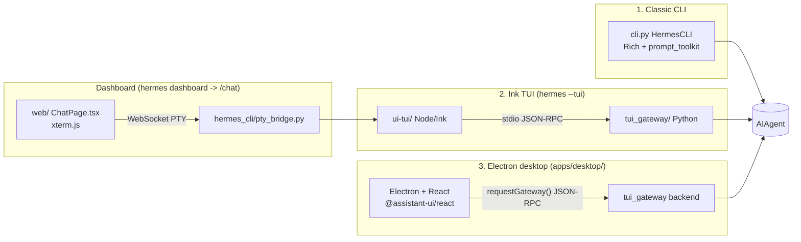

# Chat surfaces — CLI, TUI, and desktop

Hermes Agent has **three genuinely separate interactive chat surfaces**, plus a
dashboard that reuses one of them wholesale. Mixing these up is a common source of
confusion — this page exists to keep them straight (source: `AGENTS.md`'s TUI
Architecture section, cross-checked against `tui_gateway/server.py` and
`apps/desktop/package.json`).



## 1. Classic CLI (`cli.py`)

`HermesCLI` — Rich for banner/panels, `prompt_toolkit` for input with autocomplete.
`load_cli_config()` merges hardcoded defaults with the user's `config.yaml`.
`KawaiiSpinner` (`agent/display.py`) drives animated faces during API calls and a
`┊` activity feed for tool results, themed by the skin engine
(`hermes_cli/skin_engine.py` — see built-in skins `default`/`ares`/`mono`/`slate`,
or a user YAML dropped in `~/.hermes/skins/`).

`process_command()` on `HermesCLI` dispatches on the canonical command name resolved
via `resolve_command()` from the central `COMMAND_REGISTRY` in
`hermes_cli/commands.py`. Every downstream consumer (CLI, gateway's
`GATEWAY_KNOWN_COMMANDS`, Telegram's bot-command menu, Slack's `/hermes` subcommand
map, autocomplete, CLI help) derives from this one registry — see
[integrations/messaging-platforms.md](../integrations/messaging-platforms.md) for the
fan-out.

## 2. Ink TUI (`ui-tui/` + `tui_gateway/`)

A full replacement for the classic CLI, activated via `hermes --tui` or
`HERMES_TUI=1`:

```
hermes --tui
  └─ Node (Ink)  ──stdio JSON-RPC──  Python (tui_gateway)
       │                                  └─ AIAgent + tools + sessions
       └─ renders transcript, composer, prompts, activity
```

TypeScript owns the screen; Python owns sessions, tools, model calls, and
slash-command logic. Transport is newline-delimited JSON-RPC over stdio — requests
flow from Ink, events from Python; `tui_gateway/server.py` is the full method/event
catalog. `tui_gateway/server.py` also installs a panic hook that appends unhandled
exceptions to `~/.hermes/logs/tui_gateway_crash.log` and re-emits a one-line summary
to stderr (surfaced in the TUI's Activity feed) — added specifically because gateway
crashes mid-session (e.g. during voice-mode TTS) previously left no forensics, since
stdout is the JSON-RPC pipe itself.

Key surfaces (from `AGENTS.md`):

| Surface | Ink component | Gateway method |
|---|---|---|
| Chat streaming | `app.tsx` + `messageLine.tsx` | `prompt.submit` → `message.delta/complete` |
| Tool activity | `thinking.tsx` | `tool.start/progress/complete` |
| Approvals | `prompts.tsx` | `approval.respond` ← `approval.request` |
| Clarify/sudo/secret | `prompts.tsx`, `maskedPrompt.tsx` | `clarify/sudo/secret.respond` |
| Session picker | `sessionPicker.tsx` | `session.list/resume` |
| Slash commands | Local handler + fallthrough | `slash.exec` → `_SlashWorker`, `command.dispatch` |
| Completions | `useCompletion` hook | `complete.slash`, `complete.path` |
| Theming | `theme.ts` + `branding.tsx` | `gateway.ready` with skin data |

Slash-command flow: built-ins (`/help`, `/quit`, `/clear`, `/resume`, `/copy`,
`/paste`, ...) are handled locally in `app.tsx`; everything else goes to
`slash.exec`, which runs in a persistent `_SlashWorker` subprocess, falling back to
`command.dispatch`.

## The dashboard embeds the real TUI — it is not a rewrite

`hermes dashboard` → `/chat` mounts the actual `hermes --tui` process, not a React
reimplementation. `hermes_cli/pty_bridge.py` + the `@app.websocket("/api/pty")`
endpoint in `hermes_cli/web_server.py` spawn it through `ptyprocess` (POSIX PTY —
works under WSL, not native Windows). The browser side
(`web/src/pages/ChatPage.tsx`) mounts xterm.js with the WebGL renderer, `@xterm/addon-fit`
for resize, and `@xterm/addon-unicode11` for wide-character widths. `/api/pty?token=…`
auth uses the same ephemeral `_SESSION_TOKEN` as REST, passed via query param since
browsers can't set `Authorization` on a WebSocket upgrade. Resize goes over the wire
as `\x1b[RESIZE:<cols>;<rows>]`, intercepted server-side and applied with
`TIOCSWINSZ`.

**Rule from `AGENTS.md`:** do not re-implement the primary chat experience in React.
Anything added to Ink shows up in the dashboard automatically. Structured React UI
*around* the embedded TUI (sidebar widgets, inspectors, status panels) is fine as
long as it complements rather than replaces the transcript/composer/terminal, and
keeps its own state independent of the PTY child's session.

## 3. Electron desktop (`apps/desktop/`)

A **fourth, separate** chat surface — Electron + React + nanostores
(`@assistant-ui/react`), built with Vite and packaged via `electron-builder`
(`apps/desktop/package.json`: `dist:mac`, `dist:win`, etc.). It talks to a
`tui_gateway` backend over the same JSON-RPC transport (`requestGateway(method,
params)`), but does **not** embed `hermes --tui` — it has its own composer,
transcript, and slash-command pipeline. Bugs here route to a
`hermes-desktop-app-work` context, distinct from `hermes-dashboard-work`.

Its slash palette is curated client-side, then dispatched to the backend:

- The backend already exposes everything — `tui_gateway/server.py`'s
  `commands.catalog` (empty-query) and `complete.slash` (typed-query) both include
  built-ins, user `quick_commands`, and skill-derived commands
  (`scan_skill_commands()` / `get_skill_commands()`).
- `apps/desktop/src/lib/desktop-slash-commands.ts` is the load-bearing curation
  file — `DESKTOP_COMMANDS` (~19 built-ins shown in the palette) plus block-lists
  for terminal-only / messaging-only / picker-owned / settings-owned / advanced
  commands to keep out of the popover. `isDesktopSlashCommand()` gates execution
  (true for built-ins and any extension command); `isDesktopSlashSuggestion()` gates
  discovery/completion; `isDesktopSlashExtensionCommand()` is true for anything that
  isn't a known built-in (i.e. a skill or quick command) and must flow into both the
  suggestion and catalog-filter paths so skill commands aren't silently dropped from
  the palette (a real regression `AGENTS.md` documents fixing).
- Dispatch lives in `app/session/hooks/use-prompt-actions.ts`'s `runSlash`:
  desktop-owned built-ins (`/skin`, `/help`, `/new`, ...) run locally or via
  `commands.catalog`; everything else goes to `slash.exec`, falling back to
  `command.dispatch`. A skill command resolves to `{type: "skill", message}` and is
  submitted as a normal prompt.

## Related

- [integrations/messaging-platforms.md](../integrations/messaging-platforms.md) —
  the `COMMAND_REGISTRY` fan-out mentioned above, and the messaging gateway proper
  (`gateway/run.py`, distinct from `tui_gateway/`).
- [architecture/agent-loop.md](agent-loop.md) — what all three surfaces ultimately
  drive.
