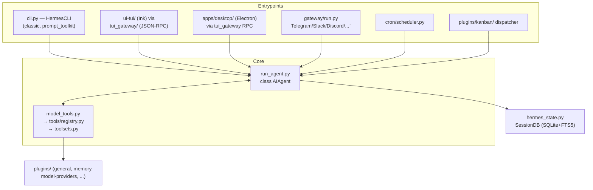

# System overview

## Entrypoints share one core

Six different ways to drive Hermes Agent all bottom out in the same `AIAgent` class
and tool-dispatch chain:



Per `AGENTS.md`'s file-dependency chain, the import direction is strict:

```
tools/registry.py  (no deps — imported by all tool files)
       ^
tools/*.py  (each calls registry.register() at import time)
       ^
model_tools.py  (imports tools/registry + triggers tool discovery)
       ^
run_agent.py, cli.py, batch_runner.py, environments/
```

`tools/registry.py`'s own docstring states the same chain for tool auto-discovery
(`tools/registry.py:1-16`): tool files import from `registry`, `model_tools.py`
imports `tools.registry` and every tool module, and `run_agent.py`/`cli.py`/
`batch_runner.py` sit on top.

## Core files and their jobs

| File | Role |
|---|---|
| `run_agent.py` | `AIAgent` class (`run_agent.py:320`) — the conversation loop. ~12k LOC per `AGENTS.md`. |
| `model_tools.py` | Thin orchestration layer over the tool registry — `get_tool_definitions()`, `handle_function_call()` (`model_tools.py:1-20`). |
| `toolsets.py` | `TOOLSETS` dict grouping tools per platform/scenario; `_HERMES_CORE_TOOLS` is the default bundle (`toolsets.py:30`). |
| `tools/registry.py` | `discover_builtin_tools()` auto-imports any `tools/*.py` with a top-level `registry.register()` call (`tools/registry.py:56`); `ToolEntry` holds each tool's schema/handler/toolset. |
| `cli.py` | `HermesCLI` class, ~11k LOC — interactive CLI orchestrator (Rich + prompt_toolkit). |
| `hermes_state.py` | `SessionDB` (`hermes_state.py:377`) — SQLite session store with FTS5 search. |
| `hermes_constants.py` | `get_hermes_home()` / `display_hermes_home()` — profile-aware path resolution used everywhere state is read/written. See [data-models/config-state-profiles.md](../data-models/config-state-profiles.md). |
| `gateway/run.py` | `GatewayRunner` — messaging-platform gateway entrypoint, ~20k LOC. See [integrations/messaging-platforms.md](../integrations/messaging-platforms.md). |
| `tui_gateway/server.py` | JSON-RPC backend the Ink TUI and Electron desktop app both talk to over stdio. |

## Extension surfaces, not core edits

Four independent plugin/extension systems hang off this core rather than requiring
changes to it — see [integrations/plugins-and-providers.md](../integrations/plugins-and-providers.md)
for each:

- **Tools** — drop a self-registering file in `tools/`, or (preferred for
  custom/local-only tools) a plugin under `~/.hermes/plugins/<name>/`.
- **General plugins** (`hermes_cli/plugins.py`) — lifecycle hooks, CLI subcommands,
  platform adapters, context engines, image/video/TTS/browser providers.
- **Memory providers** (`plugins/memory/<name>/`) — pluggable long-term memory
  backends behind the `MemoryProvider` ABC.
- **Model providers** (`plugins/model-providers/<name>/`) — inference backends,
  discovered lazily and separately from the general plugin system.

## Relationships

- `architecture/agent-loop.md` **dispatches to** `tools/registry.py` and (via
  `delegate_task`) spawns child `AIAgent` instances.
- `architecture/cli-tui-gateway.md` **surfaces** the same `AIAgent` core through
  three different UIs.
- `integrations/messaging-platforms.md` **extends** the gateway with per-platform
  adapters, itself built on the general plugin system.
- `data-models/config-state-profiles.md` **underlies** every entrypoint: all of them
  resolve state through `get_hermes_home()`.
