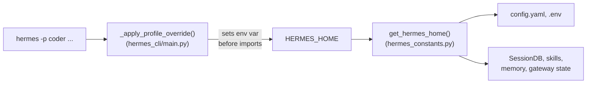

# Config, state, and profiles

## `config.yaml` vs `.env`

Two files, two purposes:

- **`~/.hermes/config.yaml`** — settings. Non-secret values (timeouts, thresholds,
  feature flags, paths, display preferences) belong here, never in `.env`.
- **`~/.hermes/.env`** — secrets only (API keys, tokens, passwords).

Top-level `config.yaml` sections (non-exhaustive, per `AGENTS.md`): `model`,
`agent`, `terminal`, `compression`, `display`, `stt`, `tts`, `memory`, `security`,
`delegation`, `smart_model_routing`, `checkpoints`, `auxiliary`, `curator`,
`skills`, `gateway`, `logging`, `cron`, `profiles`, `plugins`, `honcho`.

To add a `config.yaml` option: add it to `DEFAULT_CONFIG` in
`hermes_cli/config.py`. Bump `_config_version` **only** if existing user config
needs active migration (renamed keys, restructuring) — adding a new key to an
existing section is handled by deep-merge automatically. To add a `.env` secret:
add an entry to `OPTIONAL_ENV_VARS` in `hermes_cli/config.py` with
`description`/`prompt`/`url`/`password`/`category` metadata. If internal code needs
an env-var mirror for back-compat, bridge it from `config.yaml` in code (e.g.
`gateway_timeout`, `terminal.cwd` → `TERMINAL_CWD`), not the reverse. Working
directory: CLI uses `os.getcwd()`; messaging uses `terminal.cwd` from
`config.yaml`, bridged to `TERMINAL_CWD` for child tools (`MESSAGING_CWD` is
removed; setting `TERMINAL_CWD` directly in `.env` prints a deprecation warning).

### Three config loaders — know which one you're in

| Loader | Used by | Location |
|---|---|---|
| `load_cli_config()` | CLI mode | `cli.py` — CLI-specific defaults + user YAML |
| `load_config()` | `hermes tools`, `hermes setup`, most subcommands | `hermes_cli/config.py` — `DEFAULT_CONFIG` + user YAML |
| Direct YAML load | Gateway runtime | `gateway/run.py` + `gateway/config.py` — reads user YAML raw |

If a new key is visible to the CLI but not the gateway (or vice versa), the loader
being used is the wrong one — check `DEFAULT_CONFIG` coverage first.

## `SessionDB` (`hermes_state.py`)

`class SessionDB` (`hermes_state.py:377`, `__init__` at `hermes_state.py:400`) is
the SQLite-backed session store, with FTS5 full-text search over session history
(used by the `session_search` toolset and CLI `/resume` flows).

## Profiles — multiple isolated instances

A **profile** is a fully isolated Hermes instance with its own `HERMES_HOME`
(config, API keys, memory, sessions, skills, gateway state). Mechanism:
`_apply_profile_override()` in `hermes_cli/main.py` sets `HERMES_HOME` **before any
module imports**; every `get_hermes_home()` call downstream automatically scopes to
the active profile.

Rules for profile-safe code (from `AGENTS.md`):

1. **Use `get_hermes_home()` for all `HERMES_HOME` paths.** Never hardcode
   `~/.hermes` or `Path.home() / ".hermes"` in code that reads/writes state.
2. **Use `display_hermes_home()` for user-facing messages** — resolves to
   `~/.hermes` by default or `~/.hermes/profiles/<name>` for a named profile.
3. Module-level constants are fine as long as they cache `get_hermes_home()` at
   import time — that's already after `_apply_profile_override()` runs.
4. Tests that mock `Path.home()` must **also** set `HERMES_HOME` explicitly, since
   code reads the env var, not `Path.home()` directly.
5. Gateway platform adapters with a unique credential must use
   `acquire_scoped_lock()`/`release_scoped_lock()` (`gateway.status`) around
   connect/disconnect, so two profiles can't share one bot token — canonical
   example: `gateway/platforms/telegram.py`.
6. **Profile operations are HOME-anchored, not HERMES_HOME-anchored** —
   `_get_profiles_root()` returns `Path.home() / ".hermes" / "profiles"`
   deliberately, so `hermes -p coder profile list` can see every profile
   regardless of which one is currently active.

**Known pitfall this fixed 5 real bugs (PR #3575, per `AGENTS.md`):** hardcoding
`~/.hermes` breaks profiles because each profile has its own `HERMES_HOME`.

## Related

- [architecture/overview.md](../architecture/overview.md) — `hermes_constants.py`'s
  place in the core dependency chain.
- [operations/testing-and-release.md](../operations/testing-and-release.md) — the
  `_isolate_hermes_home` autouse test fixture that redirects `HERMES_HOME` to a
  temp dir for every test.
