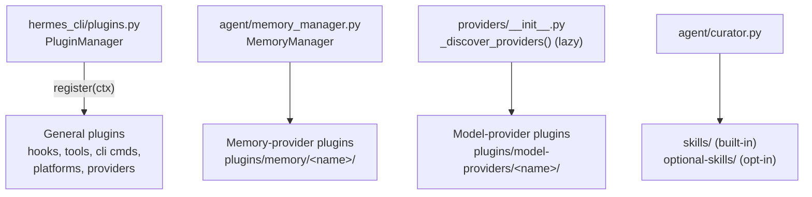

# Plugins, providers, and skills

Hermes has **four distinct extension systems**. They share a directory
(`plugins/` in-repo, mirrored by `~/.hermes/plugins/` for user installs) but have
separate discovery mechanisms — conflating them is easy to do and easy to get wrong.

## 1. General plugins (`hermes_cli/plugins.py`)

`PluginManager` (class at `hermes_cli/plugins.py:1029`) discovers plugins from
`~/.hermes/plugins/`, `./.hermes/plugins/`, and pip entry points. Each plugin
exposes a `register(ctx)` function where `ctx` is a `PluginContext`
(`hermes_cli/plugins.py:290`) offering a wide registration surface:

- `register_tool(...)` — new tools.
- `register_cli_command(...)` / `register_command(...)` — `hermes <pluginname> <subcmd>`
  wired into `main.py` with no change to it.
- `register_platform(...)` — messaging platforms (see
  [integrations/messaging-platforms.md](messaging-platforms.md)).
- `register_context_engine`, `register_image_gen_provider`,
  `register_dashboard_auth_provider`, `register_video_gen_provider`,
  `register_web_search_provider`, `register_browser_provider`,
  `register_tts_provider`, `register_transcription_provider` — pluggable backends
  for each capability.
- `register_auxiliary_task(...)` — side-LLM task overrides (curator, vision,
  embedding, title generation, session search, etc. — see the `auxiliary` config
  section).
- `register_hook(hook_name, callback)` — lifecycle hooks: `pre_tool_call`,
  `post_tool_call`, `pre_llm_call`, `post_llm_call`, `on_session_start`,
  `on_session_end`. Invoked from `model_tools.py` (pre/post tool) and
  `run_agent.py` (lifecycle).
- `register_middleware(...)`, `register_skill(...)`.

**Discovery timing pitfall:** `discover_plugins()` only runs as a side effect of
importing `model_tools.py`. Any code path that reads plugin state without importing
`model_tools.py` first must call `discover_plugins()` explicitly — it's idempotent.

**Hard rule (Teknium, May 2026, per `AGENTS.md`):** plugins must not modify core
files (`run_agent.py`, `cli.py`, `gateway/run.py`, `hermes_cli/main.py`, etc.). If a
plugin needs a capability the framework doesn't expose, the generic plugin surface
gets a new hook/`ctx` method instead of a plugin-specific hardcode — PR #5295
removed 95 lines of hardcoded honcho argparse from `main.py` for exactly this
reason.

## 2. Memory-provider plugins (`plugins/memory/<name>/`)

A separate discovery system for pluggable long-term-memory backends. Each provider
implements the `MemoryProvider` ABC (`agent/memory_provider.py:42`), orchestrated by
`MemoryManager` (`agent/memory_manager.py:244`). Lifecycle: `sync_turn(turn_messages)`,
`prefetch(query)` (`agent/memory_provider.py:93`), `shutdown()`
(`agent/memory_provider.py:151`), plus optional `post_setup(hermes_home, config)`
for setup-wizard integration.

Built-in providers (`plugins/memory/`): **honcho, mem0, supermemory, byterover,
hindsight, holographic, openviking, retaindb**. If a memory plugin defines
`register_cli(subparser)` in `plugins/memory/<name>/cli.py`,
`discover_plugin_cli_commands()` wires it into `hermes <plugin>` at argparse
setup — but only for the **currently active** provider (`memory.provider` in
`config.yaml`), so disabled providers don't clutter `hermes --help`.

**Policy (May 2026): this set is closed.** New memory backends ship as standalone
plugin repos installed into `~/.hermes/plugins/` (or via pip entry points),
implementing the same `MemoryProvider` ABC through the same discovery path. PRs
adding a new `plugins/memory/` directory get closed with a pointer to publish it as
its own repo; existing in-tree providers still take bug fixes.

## 3. Model-provider plugins (`plugins/model-providers/<name>/`)

Every inference backend (openrouter, anthropic, gmi, deepseek, nvidia, ...) ships as
a plugin here. Each `__init__.py` calls `providers.register_provider(ProviderProfile(...))`
at module load (`providers/__init__.py:53`). `_discover_providers()`
(`providers/__init__.py:140`) is a **lazy, separate** discovery system — scanned on
first `get_provider_profile()`/`list_providers()` call, not by the general
`PluginManager`.

Scan order (later wins — last-writer-wins on `register_provider()`):
1. Bundled: `<repo>/plugins/model-providers/<name>/`
2. User: `$HERMES_HOME/plugins/model-providers/<name>/`
3. Legacy: `<repo>/providers/<name>.py` (back-compat)

This lets a user override any built-in provider profile without a repo patch. The
general `PluginManager` records `kind: model-provider` manifests but deliberately
does **not** import them (would double-instantiate `ProviderProfile`); plugins
without an explicit `kind:` get auto-coerced via a source-text heuristic looking for
`register_provider` + `ProviderProfile` in `__init__.py`. Full authoring guide:
`website/docs/developer-guide/model-provider-plugin.md`.

Companion-repo plugins (not in this tree):
[`hermes-example-plugins`](https://github.com/NousResearch/hermes-example-plugins)
holds reference dashboard/context-engine/image-gen plugins.

## 4. Skills (`skills/` and `optional-skills/`)

Two parallel surfaces:

- **`skills/`** — built-in, loadable by default, organized by category directory
  (e.g. `skills/github/`, `skills/mlops/`). Categories present: apple,
  autonomous-ai-agents, creative, data-science, devops, dogfood, email, github,
  index-cache, media, mlops, note-taking, productivity, red-teaming, research,
  smart-home, social-media, software-development, yuanbao.
- **`optional-skills/`** — heavier or niche, shipped but **not** active by default;
  installed via `hermes skills install official/<category>/<skill>`, adapted
  through `tools/skills_hub.py`'s `OptionalSkillSource`. Categories:
  autonomous-ai-agents, blockchain, communication, creative, devops, email, health,
  mcp, migration, mlops, productivity, research, security, web-development.

Skill slash commands are injected by `agent/skill_commands.py`, which scans
`~/.hermes/skills/` and injects matches as a **user message** (not the system
prompt), specifically to preserve prompt caching.

### Curator (skill lifecycle)

A background maintenance system tracks usage on **agent-created** skills and
auto-archives stale ones — bundled and hub-installed skills are explicitly
off-limits (`created_by: "agent"` provenance gate). Archives go to
`~/.hermes/skills/.archive/` and are restorable; the curator never deletes, only
archives. Pinned skills are exempt from every auto-transition and the LLM review
pass; `skill_manage(action="delete")` refuses pinned skills, but patch/edit/write/remove
still go through so pinned skills stay editable.

- **Core:** `agent/curator.py` (review loop, auto-transitions, LLM review prompt) +
  `agent/curator_backup.py` (pre-run tar.gz snapshots).
- **CLI:** `hermes_cli/curator.py` wires `hermes curator <verb>` —
  `status`, `run`, `pause`, `resume`, `pin`, `unpin`, `archive`, `restore`, `prune`,
  `backup`, `rollback`.
- **Telemetry:** `tools/skill_usage.py` owns `~/.hermes/skills/.usage.json` —
  per-skill `use_count`, `view_count`, `patch_count`, `last_activity_at`, `state`
  (active/stale/archived), `pinned`.

Config section `curator:` in `config.yaml`: `enabled`, `interval_hours`,
`min_idle_hours`, `stale_after_days`, `archive_after_days`, `backup.*`. Full
user-facing docs: `website/docs/user-guide/features/curator.md`.

## Related

- [integrations/messaging-platforms.md](messaging-platforms.md) — `register_platform`
  in practice.
- [architecture/agent-loop.md](../architecture/agent-loop.md) — where `pre_tool_call`/
  `post_tool_call` hooks fire relative to `handle_function_call`.
- [data-models/config-state-profiles.md](../data-models/config-state-profiles.md) —
  `HERMES_HOME`-scoped plugin/skill installation.
