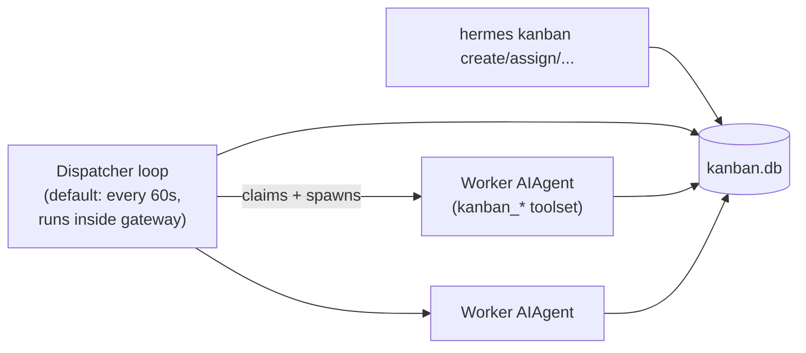

# Headless automation — cron and kanban

`delegate_task` (see [architecture/agent-loop.md](../architecture/agent-loop.md)) is
synchronous and dies with its parent turn. These two systems are the durable
alternatives — both ultimately drive `AIAgent`, just without a live conversation.

## Cron (`cron/`)

`cron/jobs.py` is the job store (`load_jobs()`/`save_jobs()`, `create_job()`,
`compute_next_run()`, `parse_schedule()`); `cron/scheduler.py` is the tick loop.
Agents schedule jobs via the `cronjob` tool; users via `hermes cron <verb>`
(`list`, `add`, `edit`, `pause`, `resume`, `run`, `remove`) or the `/cron` slash
command.

Supported schedule formats (`cron/jobs.py`'s `parse_schedule`):
- Duration: `"30m"`, `"2h"`, `"1d"`
- "every" phrase: `"every 2h"`, `"every monday 9am"`
- 5-field cron expression: `"0 9 * * *"`
- ISO timestamp (one-shot): `"2026-06-01T09:00:00Z"`

Per-job fields include `skills` (load specific skills), `model`/`provider`
overrides, `script` (a pre-run data-collection script whose stdout is injected into
the prompt — `no_agent=True` makes the script the *entire* job, skipping the LLM
call), `context_from` (chain job A's last output into job B's prompt), `workdir`
(run in a directory with its own `AGENTS.md`/`CLAUDE.md` loaded), and multi-platform
delivery.

### Hardening invariants

- **3-minute hard interrupt** on cron sessions — a runaway agent loop cannot
  monopolize the scheduler.
- **Catchup window**: half the job's period, clamped to 120s–2h.
- **Grace window**: 120s for one-shot jobs whose fire time was missed.
- **File lock** at `~/.hermes/cron/.tick.lock` prevents duplicate ticks across
  processes (`cron/scheduler.py`'s `_get_lock_paths()`).
- Cron sessions pass `skip_memory=True` by default — memory providers intentionally
  do not run during cron.
- Deliveries land in their **own** cron session with a header/footer frame, rather
  than being mirrored into the target gateway session, so the main conversation's
  message-role alternation stays intact. Delivery targets resolve through
  `cron/scheduler.py`'s `cron_delivery_targets()`/`_resolve_single_delivery_target()`,
  which is what a platform plugin's `cron_deliver_env_var` hooks into (see
  [integrations/messaging-platforms.md](../integrations/messaging-platforms.md)).

## Kanban (`plugins/kanban/` + `hermes_cli/kanban.py`)

A durable SQLite-backed board letting multiple profiles/workers collaborate on
shared tasks.

- **CLI** (`hermes_cli/kanban.py`) — `hermes kanban` verbs: `init`, `boards`
  (list/create/rm/switch/rename/set-workdir), `create` (and `swarm` for batch
  creation), `list`/`ls`, `show`, `assign`, `reclaim`, `reassign`, `diag`, `link`,
  `unlink`, `claim`, `comment`, `complete`, `edit`, `block`, `schedule` (park
  waiting-on-time tasks distinctly from waiting-on-human), `unblock`, `promote`,
  `archive`, `tail`, plus less-common `watch`, `stats`, `runs`, `log`, `assignees`,
  `heartbeat`, `notify-*`, `dispatch`, `daemon`, `gc`.
- **Worker/orchestrator toolset** (`tools/kanban_tools.py`) — `kanban_show`,
  `kanban_complete`, `kanban_block`, `kanban_heartbeat`, `kanban_comment`,
  `kanban_create`, `kanban_link` always available; profiles that explicitly enable
  the `kanban` toolset outside a dispatcher-spawned task also get `kanban_list` and
  `kanban_unblock` for board routing.
- **Dispatcher** — long-lived loop, default 60s tick: reclaims stale claims,
  promotes ready tasks, atomically claims, and spawns the assigned profile. Runs
  **inside the gateway process** by default (`kanban.dispatch_in_gateway: true`).
  Can also run standalone via the systemd unit at
  `plugins/kanban/systemd/hermes-kanban-dispatcher.service`.
- **Dashboard** — `plugins/kanban/dashboard/` ships a web UI backed by
  `plugin_api.py`.

### Isolation model

- **Board** is the hard boundary — workers spawn with `HERMES_KANBAN_BOARD` pinned
  in their environment, so a worker cannot see other boards.
- **Tenant** is a *soft* namespace within a board — one specialist worker fleet can
  serve multiple businesses via workspace-path + memory-key isolation, without
  needing separate boards.
- After `kanban.failure_limit` consecutive non-success attempts on the same task
  (default 2), the dispatcher auto-blocks it to prevent spin loops.

Full user-facing docs: `website/docs/user-guide/features/kanban.md`.

## Related

- [architecture/agent-loop.md](../architecture/agent-loop.md) — `delegate_task`,
  the synchronous alternative these two systems exist to replace for durable work.
- [data-models/config-state-profiles.md](../data-models/config-state-profiles.md) —
  how `workdir`/profile scoping interacts with cron jobs and kanban boards.
